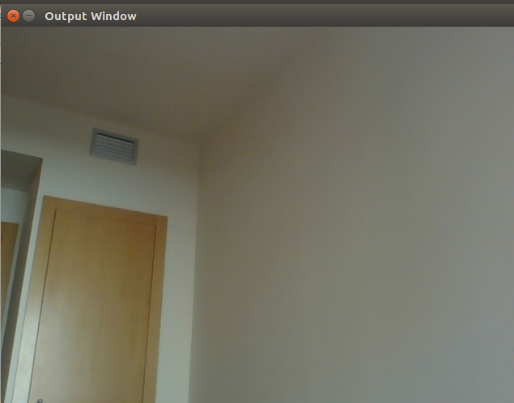

# webcam_capture

Aquest programa permet la visualització de la imatge de la webcam de l'ordinador.

Per tal de baixar el programa  webcam_capture, simplement s’ha de clonar el repositori de *webcam_capture* a partir de la comanda *git clone https://github.com/Martygp95/webcam_capture.git*.

Un cop clonat el repositori, simplement s’ha d’accedir en aquest i executar les següents comandes:

- *mkdir build*, per tal de crear una carpeta de build en el repositori
- *cd build*, per tal de treballar en el directori creat
- *cmake ..* per tal de generar els arxius necessaris per crear el programa
-make per generar l’executable
-Un cop realitzades aquestes comandes, el programa es podrà executar a partir del la comanda ./webcam_capture.

Un cop executat s’hauria d’obrir una finestra mostrant la imatge de la càmara:

