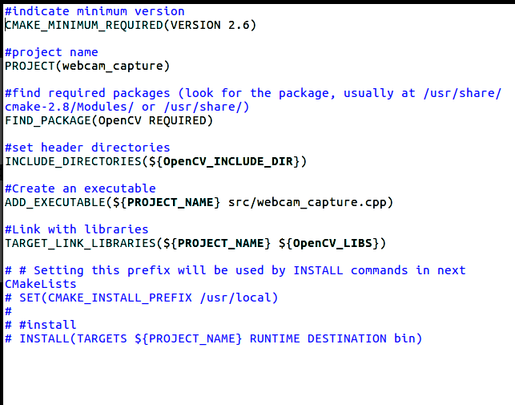

# webcam_capture

Aquest programa permet la visualització de la imatge de la webcam de l'ordinador.

Per tal de baixar el programa  webcam_capture, simplement s’ha de clonar el repositori de *webcam_capture* a partir de la comanda *git clone https://github.com/Martygp95/webcam_capture.git*.

Un cop clonat el repositori, simplement s’ha d’accedir en aquest i executar les següents comandes:

- *mkdir build*, per tal de crear una carpeta de build en el repositori
- *cd build*, per tal de treballar en el directori creat
- *cmake ..* per tal de generar els arxius necessaris per crear el programa
-make per generar l’executable
-Un cop realitzades aquestes comandes, el programa es podrà executar a partir del la comanda ./webcam_capture.

Un cop executat s’hauria d’obrir una finestra mostrant la imatge de la càmara:

## Descripció de l'arxiu CMakeLists.txt

En aquest apartat s'explica l'arxiu CMakeLists.txt.

Com en l’exemple del Hello World, primer s’indica la versió requerida del Cmake (CMAKE_MINIMUM_REQUIRED), el qual exigeix que la versió sigui igual o superior a l’establerta, degut a que el comportament del Cmake vaia en funció de la versió.

El següent paràmetre definit serà el nom del executable, que s’anomenarà webcam_capture. Es posa amb la comanda PROJECT.

Amb la comanda FIND_PACKAGE definirem els paquets necessaris per al projecte, en aquest cas el OpenCV.

Amb la comanda INCLUDE DIRECTORIES, ens permet definir els directoris en els quals trobarem els includes necessaris per al projecte.

Amb la comanda ADD_EXECUTABLE, indicarem que es vol crear l’executable, i li diem que serà amb el nom del projecte, que es pot fer amb PROJECT_NAME.

Amb la comanda TARGET_LINK_LIBRARIES, permet enllaçar les llibreries amb el programa. S’han de definir dos paràmetres, en aquest cas el nom del projecte utilitzat en el ADD_EXECUTABLE, i la corresponent llibreria que volem enllaçar.
